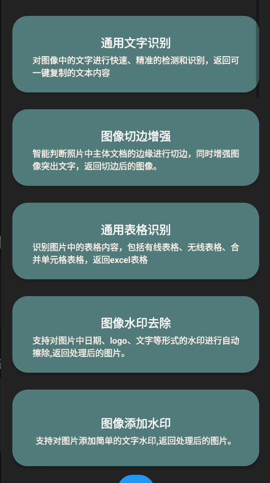
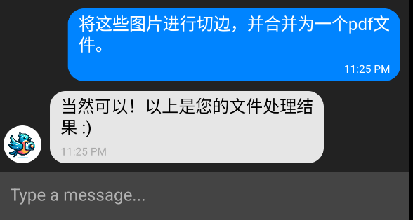
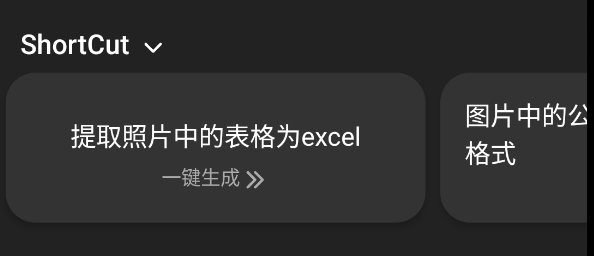
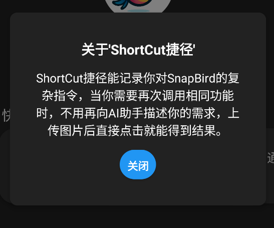
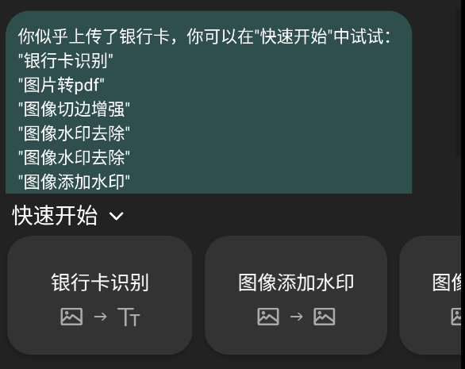
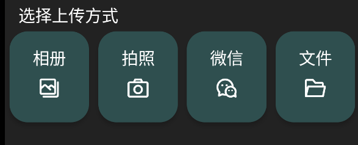

# 项目概览doc

## 背景：
#### 1.现存的商品缺陷。
现在的图像文档处理市场，已经拥有非常强大非常全面的图像处理、文字表格识别、文档内容提取产品API，但是其种类繁多且名称复杂。
举例来说，textin作为专业的服务提供商，其官网有83种API；全能扫描王（textin旗下app）一个页面就含有26种功能。且这些功能中，不乏名称较为专业，易使用户混淆困惑的功能。强大和全面的API功能，使其具有了一定的专业性，对于普通的使用者来说，就不可避免的产生了学习成本和使用门槛（此处结合调查问卷等形式数据证明）。
本产品的一个核心想法就是：通过引入自然语言处理大模型，帮助分析用户需求，自动调用API，将用户简单的语言需求描述转化为复杂的功能调用策略，让不了解全局功能的用户也能随意使用任何功能，从而降低使用门槛，提升用户体验。
#### 2.传统的app无法快速解决用户的多操作需求。
举例来说，一个大学生在纸面上完成了作业，但是他的老师要求他提交pdf和word格式的电子文档，那么在传统的单操作策略app中，他将经历以下步骤(假设他不常使用文档处理app)：对纸质作业进行拍照->上传至文档处理app->寻找图片转pdf功能->调用功能并等待pdf结果->寻找图片转word功能->调用功能并等待word文档结果->保存两个结果文件。这样的用户体验繁琐且缓慢，这也是为什么类似的操作，多数用户会选择在电脑上完成。但是，如果我们引入能根据用户语言分析出策略并自动调用功能的大模型，用户上传完图片后只需要输入对话框：帮我将这些图片转为一个pdf和一个word文档，随后等待结果即可。
#### 3.创新性app交互方式实践。
在以上基础上，本产品还进一步增强了用户体验：包括四种文档上传方式（微信上传正在开发中），首页一键调用常用功能，AI助手历史会话记录：需要再次调用历史AI助手功能时直接在首页点击调用，而不用再次与AI进行对话。且iOS、andriod、小程序全平台支持（ios和微信小程序正在开发中）。  
## 功能列表
#### 1.基本功能19项（本部分功能未说明则默认使用合合信息API）：

* 通用文字识别
* 通用表格识别
* 图像切边增强
* 图片转word
* pdf转word
* pdf转excel
* PDF转PPT
* PDF转图片
* Word转PDF
* Excel转PDF
* 图片转PDF
* Word转图片
* 图像去水印
* 图像水印添加（非API调用，团队自己后端实现）
* 驾驶证识别
* 银行卡识别
* 身份证识别
* 营业执照识别
* 通用国内票据识别
### 2.AI助手专属功能2项（全部为API调用）
* pdf、word文件合并
* NLP图像文字信息抽取
### 3.AI助手
* 基于对gpt-4-1106-preview的预训练，我们实现了能对复杂用户需求进行分析处理的功能。用户在聊天界面描述自己对上传文件的处理需求，apt负责对需求进行分析并返回标准的处理次序给后端，后端调度算法按序调用API及后端其他函数，返回处理结果。
* 此外，AI助手还支持对用户提出的图像处理类的问题进行详细解答。
* 
### 4.用户体验增强功能
* 
* **ShortCut捷径——记录用户的AI助手功能调用：**
* AI助手的功能需求往往十分复杂，有时用户突出的需求甚至会是几十个字的需求描述。ShortCut捷径会记录用户对AI助手提出的需求，并提供一键再次调用的接口，用户不需要重复之前的输入，就能完成之前的复杂操作。
* 
* **图像内容识别模型————智能指导用户调用预期功能：**
* 团队训练了残差神经网络模型，以用于对用户输入图像内容进行分类，根据不同内容（如票据，驾驶证，身份证，文档等等）智能对用户可调用的功能提出建议，真正做到0学习成本使用。用户上传图片后自动返回智能操作建议，并动态更新下方“快速开始”的功能选项。 
* 
* **多种文件上传方式：**
* 文件上传、拍照上传、相册上传、微信上传（微信正在对接中）
* 

## 系统设计实现(项目文档对应部分模板)
以下是一份简要的技术设计与实现方案。

### 1. 流程框架设计（后面加思维导图）
- **智能识别功能**: 用户上传文件，移动端自动判别文件类型，如果是EXCEL,PPT,WAORD,PDF形式文件，直接给出相应的处理建议，并动态更新功能选择栏；如果是图片文件，则由后端模型识别给出图片内容类型，如果是身份证、银行卡、营业执照、发票等，则移动端给出相应的处理建议，并动态更新选择栏；如果是其他类型则不进行任何操作。
- **快速开始**: 用户上传文件，选择功能，后端服务器判断功能是否需要合合API，需要则调用相应API接口，不需要则按需调用图像处理函数。返回结果到移动端进行预览展示。
- **AI助手**: 用户在聊天界面对AI助手提出复杂需求，服务端调用预训练过的gpt-4-1106-preview模型对用户需求进行分析，返回API或图像处理函数的调用次序给服务端，服务端按调度算法按序调用，返回结果给移动端。
- **捷径ShortCut**: ShortCut捷径会记录用户对AI助手提出的需求，并提供一键再次调用的接口，用户不需要重复之前的输入，就能完成之前的复杂操作。

### 2. 技术选型

- **移动端开发平台**: React Native和Taro，实现跨平台开发。原生的React Native库不能满足全部要求，于是我们引入了react-native-navigation、react-native-fs、react-native-gifted-chat等等一系列第三方模块实现Andriod、Ios端app交互。对于正在开发的Taro平台，由于其代码限制十分严格，我们仅采用其原生库和路由模块。
- **服务端开发平台**: 使用Python的Flask框架和PIL图像处理、pymysql数据库管理、pytorch模型训练和调用，以及PyPDF2、zipfile、docx等文件处理库函数。
- **图像处理技术**: 大部分功能如文字识别、通用表格识别、图像切边增强、文档格式转换等使用合合信息API，同时后端添加一些PIL图像处理算法，以实现团队额外添加水印功能。
- **云服务**: 腾讯云服务器（111.231.21.55）2Core/4GB/5Mbps。
- **数据库**: 使用Mysql存储用户列表，包括用户名，密码，会员权限，AI助手调用记录等。

### 3. 基本架构（后面加思维导图）

- **客户端**: 负责用户交互界面UI、文件上传、用户需求收集、用户行为指导、简单的文档处理。
- **服务器运行**: 负责调用图像处理函数、二次封装用户请求、调用合合信息API、调用图像识别模型、提交用户需求到GPT、返回结果到移动端。
- **存储层**: 包括本地存储（用于临时保存文档）和云存储（用于文档备份和同步）。

### 4. 开发步骤（扩写每一点，使劲扩随便扩，后面加截图）

1. **移动端界面搭建**：
2. **服务端框架搭建**：
3. **服务端API函数接入**：
4. **GPT AI助手预训练**：
5. **服务端复杂功能调度函数接入**：
6. **移动端AI助手界面搭建**：
7. **图像内容识别模型训练和服务端接入**：
8. **移动端用户行为指导模块**：
9. **用户数据库搭建和接入**：
10. **移动端登录界面搭建和用户权限管理**：
11. **捷径功能**：
12. **测试**：

### 5. 风险评估与应对（扩写）

### 参考资料文档：
* https://taro-docs.jd.com/docs/
* https://reactnative.cn/docs/
* https://reactnavigation.org/docs
* https://platform.openai.com/docs/models/gpt-4-and-gpt-4-turbo
* https://openai.com/blog/new-models-and-developer-products-announced-at-devday

## todo：
* 捷径栏更新
* 使用Taro框架重写，接入微信小程序平台
* pdf拆分
* 单指令多操作可能性实践
* word，pdf写入，合并连接
* 模型的上下文理解
* 文件合法性鉴别
###### bugs：
* 中文文件名丢失
* 并发性问题
* √ 无法检测用户退出状态，及时更新后端目录
